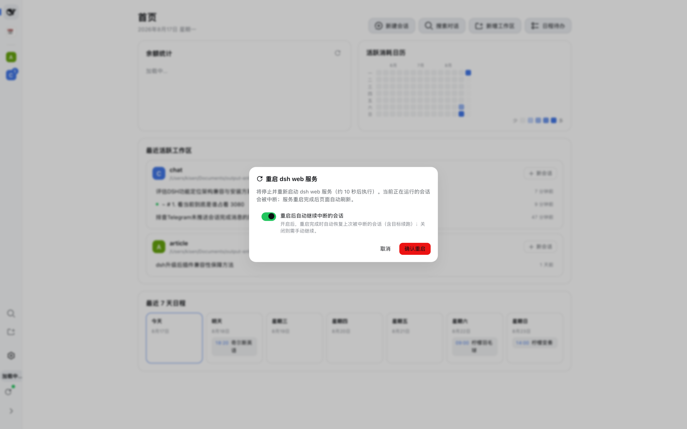
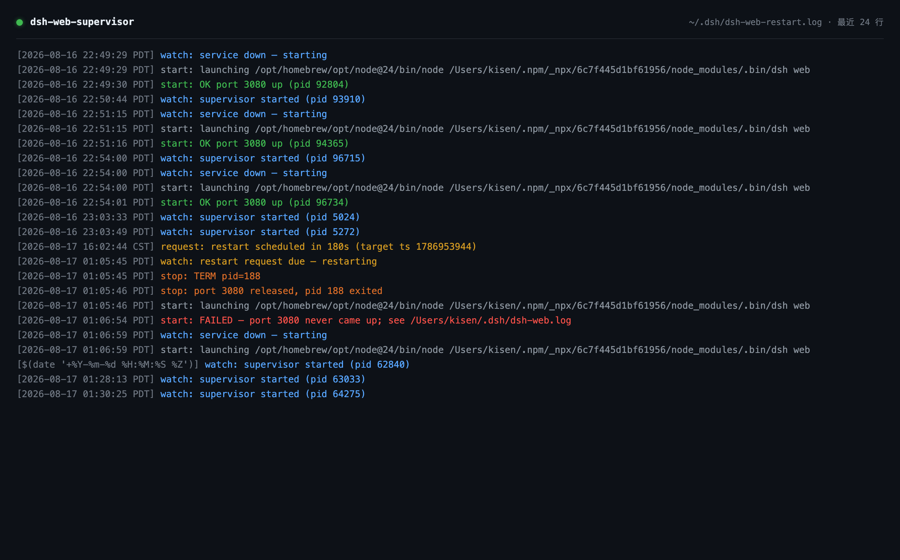

# dsh-web-restart

DSH web 插件：从界面重启 dsh web 服务，不再需要人工重启；并可选地在重启后**自动继续**被中断的会话。

## 功能图示

**侧边栏底部重启按钮**：任何布局（首页 / 会话 / 日历模式）下都固定在左 rail 最底部。
圆点颜色反映状态：绿 = 服务运行中、监督进程在线；黄 = 已有重启请求排队；红 = 监督进程未运行。


**确认弹窗**：点击按钮后居中弹出，说明操作影响并展示"重启后自动继续中断的会话"开关；
只有点击"确认重启"才会真正发出请求，杜绝误触。



**监督进程日志**（`~/.dsh/dsh-web-restart.log`）：完整记录 轮询 → 请求到期 → 停止(TERM)
→ 端口释放 → 重新拉起 的链路；服务意外掉线时 watch 直接拉起（崩溃自愈）；启动失败会把
服务日志尾部一并落盘，方便定位（如插件依赖缺失）。



## 应用场景

- **升级 dsh / 插件后一键生效**：host 半的改动需要重启 dsh web 进程。以往要在终端里手动
  kill + 重启（还要担心会话中断）；现在点一下按钮，约 10 秒后服务回来，被中断的会话自动继续。
- **长任务与目标续跑（autoContinueAfterRestart）**：夜间无人值守跑 goal 任务时，任何一次
  服务重启（升级、掉线、手动）后，被中断的顶层会话与 active goal 会在下次启动时自动恢复续跑，
  不用早上起来手动"继续"。
- **服务崩溃自愈**：dsh web 意外退出后，launchd 监督进程 5 秒内自动拉起（无需登录终端）；
  GUI 状态点实时反映监督进程是否在线。
- **无人值守 / 远程环境**：监督进程独立于 dsh web 进程树（launchd 托管、KeepAlive 保活），
  即使 dsh web 完全不可用，重启链依然可用；`halt` 命令一条命令彻底停掉守护进程。
- **本地开发迭代插件**：改了插件 host 代码后点按钮重启即可生效；`ensure_deps` 会在启动前
  自动补装缺失的插件依赖——曾因插件目录 `node_modules` 被清导致重启后起不来、服务宕机约
  一小时，现在 supervisor 能自愈。

## 名字
- 插件包：`dsh-web-restart`（host 行 id：`web-restart`）
- 配套监督进程（launchd）：`com.dsh.web-supervisor`，脚本 `~/.dsh/scripts/dsh-web-supervisor.sh`

## 功能
- **Host 端**（`lib/index.js`，注入 `webServer` / `agents` / `goals` / `sessionQuery` / `sessionPersistence`）：
  - `GET /plugin/dsh-web-restart` → 返回当前进程 pid、监督进程是否存活、是否有待执行的重启请求、自动继续开关与上次扫描结果
  - `POST /plugin/dsh-web-restart`（body `{ "delay": 10 }`）→ 写入重启请求文件 `~/.dsh/dsh-web.restart-request`
  - `GET|POST /plugin/dsh-web-restart/config` → 读写自动继续开关（持久化到 `~/.dsh/dsh-web-restart.json`）
- **Client 端**（`lib/client.js`，注入 `slots`、`locale`、`settingsScope`）：
  - 在**侧边栏（左 rail）最底部**（`sidebar.rail.footer` 插槽，与余额等底部项并列；首页 / 会话 / 日历模式等任何布局都固定可见）放重启按钮：环形箭头 icon（rail 展开为宽栏时带文字标签），带状态圆点（绿=运行中 / 黄=重启排队中 / 红=监督进程未运行）；
    - 绿 = 服务运行中、监督进程在线；黄 = 已有重启请求排队；红 = 监督进程未运行 / 状态获取失败
  - **点击按钮弹出居中确认弹窗**：描述操作效果（服务将停止并重启、运行中的会话会被中断、自动继续开关状态）与"确认重启 / 取消"按钮；**只有点击"确认重启"才会发出请求**，杜绝误触；确认后图标旋转表达"重启中"，页面在延迟后自动刷新（Esc / 点击遮罩 / 取消可关闭弹窗，监督进程未运行时确认按钮禁用）
- **设置卡片**（client 半）：在 **设置 → 插件 → 插件配置** 注册一张卡片（id `web-restart`），就地展开后是"重启后自动继续中断的会话"开关，按 settings 领域惯例：暂存 → 保存 / 放弃修改 / 恢复默认，并标注是否"已覆盖"。
  > **已知限制**：在 include 方式挂载的部署（如仓库 `link:` 工作区插件）下，插件注册的 settings
  > 命名空间可能不出现在 UI 的 `settings.describe` 列表里，卡片因此静默不显示。开关此时可用
  > **重启弹窗内的同名开关**，或直接编辑 `~/.dsh/settings.yaml` 的 `web-restart` 分节；
  > 两条写入路径都走同一个 settings 文档，效果一致。

## 自动继续（autoContinueAfterRestart）

- **开（默认关）**：服务重启完成后（插件启动约 2 秒后）执行一次扫描：
  1. 枚举所有持久化的顶层会话（`delegationDepth === 0`，子代理随父会话一起恢复）；
  2. 读取每个会话日志尾部，识别"被上次停机中断"的会话：**开放的 turn**（进程被强杀）或 **turn/end 因非用户原因中止**（SIGTERM 优雅停机时 agent 以 `{kind:'disposed'}` / goal 驱动器以 `{kind:'parent'}` 中止；用户主动点"停止"是 `{kind:'user'}`，**绝不会**被自动继续）；
  3. 只处理**上次启动标记之后**被中断的会话（配置文件的 `lastBootAt`），更早的崩溃残留不会突然被拉起；
  4. 对每个会话：`ctx.agents.resume` 恢复 agent（日志尾部的损坏由持久化后端的崩溃修复自动补齐，中断的工具调用会获得 `TOOL_OUTCOME_UNKNOWN` / `TOOL_NOT_STARTED` 结果）；
  5. **有 active goal** → `ctx.goals.resume` 重新武装续行，goal-round-driver 自动排下一轮 `<goal_round>` 继续跑（暂停/阻塞的 goal 不动，尊重用户意图）；
     **无 goal** → 注入一条合成的用户消息"（服务已重启）请继续之前中断的工作…"触发新回合；
  6. 结果写入 `~/.dsh/dsh-web-restart.json` 的 `lastSweep`，并输出到服务日志（`~/.dsh/dsh-web.log`）。
- **关**：一切照旧——重启后需要人工打开会话继续（说"继续"即可，goal 会话也可 `/goal resume`）。

### 配置方式（二选一）
1. **设置界面（推荐）**：**设置 → 插件 → 插件配置** → 展开"重启服务设置"卡片 → 切换开关 → 保存。
   （若卡片因部署差异未显示，用**重启弹窗内的同名开关**，效果相同。）
2. **设置文档 / 补丁**：用户覆盖写入 `~/.dsh/settings.yaml` 的 `web-restart` 分节（直接编辑该文件也会被 watcher 热发布）：
   ```yaml
   web-restart:
     autoContinueAfterRestart: true
   ```
   组装默认值在插件的 `cordis.patch.yml`（`config.autoContinueAfterRestart: false`），机器级补丁（`~/.dsh/cordis.patch.yml` 整行替换该行）可改默认值。
   优先级（settings 领域标准）：用户设置分节 > 注册方 base（entry 配置）> schema 默认 false。
   旧版本写在 `~/.dsh/dsh-web-restart.json` 里的开关会在首次启动时自动迁移进设置文档（该文件此后只存运行状态）。

### 设计取舍
- **只继续"被上次重启中断"的会话**，不自动拉起空闲会话，也不复活用户主动停止的工作；
- 恢复的 agent 与 GUI 打开会话是同一机制（`ctx.agents.resume`，模型选择从会话日志的最近请求头继承），因此行为与手动打开一致；
- 若重启后你已先打开了某个会话并开始新回合（agent 正在运行），扫描会跳过它，不会重复注入。

## 为什么重启动作不在插件里做
插件运行在 dsh web 进程内部，杀掉宿主进程等于自杀（脚本会随宿主一起死）。
因此插件只负责"请求"，真正的 kill + 启动由 launchd 托管的监督进程（进程树之外）执行：
supervisor 每 5 秒轮询请求文件，发现到期请求就执行 停止 → 等端口释放 → 启动 → 健康检查；
服务意外掉线时 supervisor 也会直接拉起（崩溃自愈）。

监督脚本（v0.3）要点：
- **`ensure_deps`**：每次启动前检查 profile 里所有 `link:` 插件目录的依赖，缺失则自动
  `npm install`——修复了"插件目录 node_modules 被清后 dsh web 启动即崩、服务宕机数小时"的故障；
- **失败诊断**：`start` 失败时把 `~/.dsh/dsh-web.log` 尾部写进监督日志，根因不用翻文件；
- **单实例锁**（mkdir 原子锁 + 陈旧锁回收），避免 watch 重复运行；
- **失败退避**：连续启动失败时轮询间隔 5s → 30s → 60s，避免空转；
- **`halt` 命令**：一条命令彻底停掉守护（launchctl bootout + 停服务）；注意 `stop` 只是
  临时停——watch 会在 5 秒内拉回（launchd KeepAlive 也会重生被杀的 supervisor）。

## 安装

```bash
dsh plugin --profile web add dsh-web-restart
# 或使用 GitHub Release tarball：
# dsh plugin --profile web add https://github.com/qschen86/dsh-web-restart/releases/download/v0.2.0/dsh-web-restart-0.2.0.tgz
dsh --profile web --dump-config   # 验证条目已加入 bundles
# 重启 dsh web（host 半生效），刷新页面（client 半生效）
```

## 初始化（首次安装必做）

重启按钮本身是"请求方"——真正的 kill + 启动由 **launchd 监督进程**执行
（按钮显示**红色状态点 = 监督进程未运行**）。监督脚本与 plist 模板已随包发布
（tarball 内 `scripts/`，或仓库 `scripts/` 目录）：

1. **部署监督脚本**：

   ```bash
   mkdir -p ~/.dsh/scripts
   cp scripts/dsh-web-supervisor.sh ~/.dsh/scripts/ && chmod +x ~/.dsh/scripts/dsh-web-supervisor.sh
   ~/.dsh/scripts/dsh-web-supervisor.sh status   # 此时应显示 stopped
   ```

2. **部署 launchd 配置**（按本机调整脚本路径；dsh 不在 PATH 时在
   `EnvironmentVariables` 里设 `DSH_BIN`，例如 npx 缓存路径）：

   ```bash
   cp scripts/com.dsh.web-supervisor.plist.example ~/Library/LaunchAgents/com.dsh.web-supervisor.plist
   # 编辑 plist：把 /Users/YOUR_USER 换成你的用户名
   launchctl bootstrap gui/$(id -u) ~/Library/LaunchAgents/com.dsh.web-supervisor.plist
   ```

3. **验证**：约 5 秒后 `~/.dsh/scripts/dsh-web-supervisor.sh status` 应输出
   `running`；再刷新页面，重启按钮应变为绿色状态点。

4. **卸载插件时一并移除监督进程**（可选）：

   ```bash
   launchctl bootout gui/$(id -u)/com.dsh.web-supervisor
   rm ~/Library/LaunchAgents/com.dsh.web-supervisor.plist
   dsh plugin --profile web remove dsh-web-restart
   ```

> 只装插件不装监督进程 = 按钮永远红色、重启请求不会被执行（插件与脚本设计上
> 分离，监督进程缺位不会影响 dsh web 本身）。

5. **彻底停止 / 重新启用守护**（可选）：

   ```bash
   ~/.dsh/scripts/dsh-web-supervisor.sh halt                          # 停守护（bootout + 停服务）
   launchctl bootstrap gui/$(id -u) ~/Library/LaunchAgents/com.dsh.web-supervisor.plist   # 重新启用
   ```

## 依赖说明

host 半静态导入 `@deepseek-ai/schemastery`（构造 settings 命名空间的 schema），
已在 package.json 声明为正式依赖（`dependencies`）。

- **tarball / `dsh plugin add` 安装**：依赖随包安装进 profile，由包管理器解析，无需额外处理。
- **本地 `link:` 开发**（仓库直接挂进 profile，如 `dsh-web-restart: link:...`）：pnpm 的
  `link:` 只建符号链接、**不会安装目标包自身的依赖**——插件目录必须有自己的
  `node_modules`（`cd dsh-web-restart && npm install`）。依赖缺失时 dsh web 启动会因插件树
  加载失败直接退出（`ERR_MODULE_NOT_FOUND`，曾导致重启后服务宕机约一小时）。
- **自愈**：监督脚本 v0.3 的 `ensure_deps` 在每次启动前检查并自动补装缺失依赖；即使插件
  目录被 `git clean -fdx` 清空，下一次重启也会自动恢复。

## 相关文件
- 重启请求文件：`~/.dsh/dsh-web.restart-request`（内容为到期 unix 秒时间戳）
- 运行时状态（启动标记 / 上次扫描结果，非用户配置）：`~/.dsh/dsh-web-restart.json`；用户配置：`~/.dsh/settings.yaml`（`web-restart` 分节）
- 监督进程日志：`~/.dsh/dsh-web-restart.log`、`~/.dsh/dsh-web.log`
- launchd：`~/Library/LaunchAgents/com.dsh.web-supervisor.plist`
- 截图：`docs/screenshots/`（01 重启按钮 / 02 确认弹窗 / 04 监督日志）
